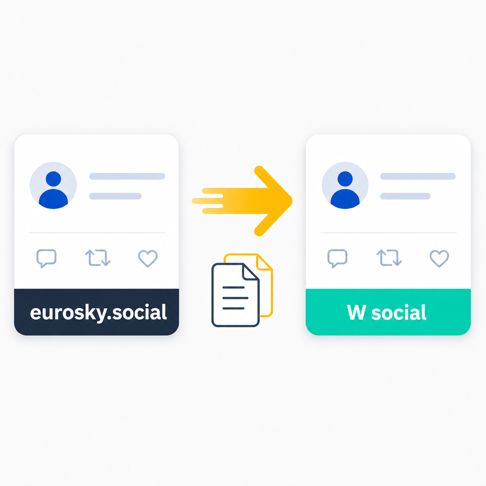

# ATProto PDS Mirror

<p align="right"><a href="README.md">English</a> · <b>Deutsch</b></p>

<p align="center">
  
</p>

<p align="center">
  <a href="#"></a>
  <a href="LICENSE"></a>
</p>

Spiegelt Top-Level-Posts von einem [AT Protocol](https://atproto.com) PDS zu einem anderen. Geschrieben für den Anwendungsfall `eurosky.social` → `wsocial.eu`, funktioniert aber mit beliebigen ATProto-PDS-Instanzen.

## Warum

Wer Konten auf mehreren AT-Protocol-Instanzen betreibt, will dort nicht manuell doppelt posten. Dieses Script überwacht einen Quell-PDS per Cronjob und erstellt neue Posts automatisch auf dem Ziel-PDS. Replies und Reposts werden ignoriert, nur eigene Top-Level-Posts werden gespiegelt.

## Wie es funktioniert

Das Script läuft als PHP-Cronjob auf Shared Hosting (entwickelt für [All-Inkl](https://all-inkl.com), läuft auf jedem Hoster mit PHP 8.x, MySQL und cURL).

Pro Durchlauf passiert Folgendes:

1. **Authentifizierung** auf beiden PDSen via `com.atproto.server.createSession`
2. **Abruf** der letzten Posts vom Quell-PDS via `com.atproto.repo.listRecords`
3. **Filterung**: Replies werden übersprungen, nur Top-Level-Posts durchgelassen
4. **Abgleich** gegen die MySQL-Tabelle `mirror_posts`, ob der Post bereits gespiegelt wurde
5. **Embeds re-uploaden**: Falls der Post Bilder, Videos oder Link-Card-Thumbnails enthält, wird der Blob vom Quell-PDS geladen (`com.atproto.sync.getBlob`), auf den Ziel-PDS hochgeladen (`com.atproto.repo.uploadBlob`) und die Referenzen im Record ersetzt
6. **Post erstellen** auf dem Ziel-PDS via `com.atproto.repo.createRecord`
7. **Protokollieren** des Ergebnisses in MySQL

Unterstützte Embed-Typen: Bilder, Videos, External Links (mit Thumbnail), Record-with-Media (z.B. Zitat-Posts mit Bildern).

## Dateien

| Datei | Bedeutung |
|-------|-----------|
| `mirror.php` | Hauptscript, wird per Cron aufgerufen |
| `config.example.php` | Konfigurationsvorlage – nach `config.php` kopieren |
| `seed.php` | Einmal-Script: markiert alle bestehenden Posts als geseedet |
| `test.php` | Verbindungstest für DB und beide PDSe |
| `.htaccess` | Sperrt `config.php`, Logs und Hilfsscripts per HTTP |

`config.php` und `mirror.log` sind per `.gitignore` ausgeschlossen und werden nie committet.

## Voraussetzungen

- PHP 8.0+ mit cURL-Extension
- Eine MySQL-Datenbank
- App Passwords auf beiden PDS-Instanzen
- Die **PDS-URL** des Ziel-Servers (nicht unbedingt identisch mit der Web-URL – prüfbar über das DID-Dokument auf [plc.directory](https://plc.directory))

## Setup

**1. Dateien hochladen** in ein Verzeichnis auf dem Webserver, z.B. `/www/htdocs/user/mirror/`.

**2. Konfiguration anlegen:**

```bash
cp config.example.php config.php
```

In `config.php` eintragen: PDS-URLs, Handles, App Passwords und MySQL-Zugangsdaten.

> **Tipp:** Die PDS-URL des Ziel-Servers findet man über das DID-Dokument:
>
> ```bash
> curl -s https://plc.directory/did:plc:DEINE_DID | python3 -m json.tool
> ```
>
> Der Wert unter `service[0].serviceEndpoint` ist die PDS-URL.

**3. Verbindung testen:**

```bash
php test.php
```

Prüft DB-Verbindung, Tabellenerstellung und Authentifizierung auf beiden PDSen.

**4. Bestehende Posts seeden:**

```bash
php seed.php
```

Trägt alle bisherigen Posts in die Datenbank ein, *ohne* sie zu spiegeln. Dieser Schritt verhindert, dass der erste Cronjob-Lauf den gesamten Post-Verlauf auf den Ziel-PDS kopiert.

**5. Cronjob einrichten** (alle 5 Minuten):

```
*/5 * * * * php /www/htdocs/user/mirror/mirror.php
```

Falls der Hoster den Cron als HTTP-Request ausführt, die URL des Scripts als Ziel verwenden. Die `.htaccess` ist so konfiguriert, dass `mirror.php` per HTTP erreichbar bleibt, während sensible Dateien gesperrt sind.

## Logging

Das Script schreibt nach `mirror.log` im Scriptverzeichnis. Bei CLI-Ausführung wird zusätzlich auf stdout ausgegeben. Jeder Lauf protokolliert Authentifizierung, verarbeitete Posts und eventuelle Fehler.

## Datenbank

Die Tabelle `mirror_posts` wird beim ersten Lauf automatisch angelegt. Struktur:

| Feld | Bedeutung |
|------|-----------|
| `source_uri` | AT-URI des Original-Posts |
| `source_cid` | Content-Hash des Original-Posts |
| `target_uri` | AT-URI des gespiegelten Posts (`NULL` bei geseedeten) |
| `target_cid` | Content-Hash des gespiegelten Posts |
| `created_at` | Erstellungszeitpunkt des Original-Posts |
| `mirrored_at` | Zeitpunkt der Spiegelung |

Geseedete Posts (aus `seed.php`) erkennt man an `target_uri = NULL`.

## Einschränkungen

- Keine Echtzeit-Spiegelung, Verzögerung entspricht dem Cron-Intervall
- Quote-Posts werden gespiegelt, aber die Referenz zeigt auf den Original-Post auf dem Quell-PDS (nicht auf eine lokale Kopie)
- Gelöschte Posts auf der Quelle werden nicht automatisch auf dem Ziel gelöscht
- Das Script setzt voraus, dass der Ziel-PDS die Standard-XRPC-Endpunkte offen hat

## Lizenz

[MIT](LICENSE) © Oliver Eichhof
